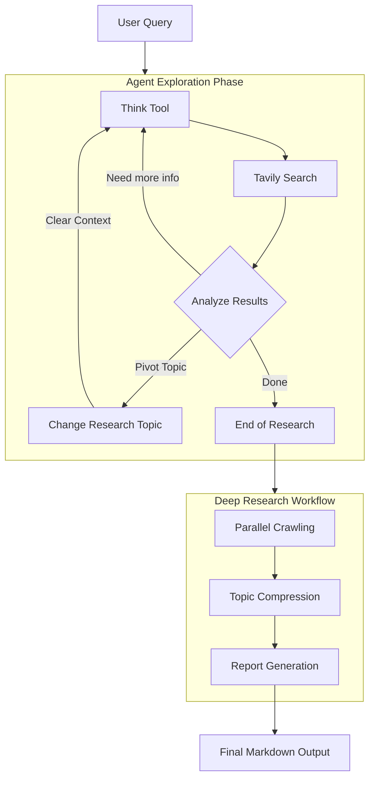

# Deep Research Agent V2

Deep Research Agent V2 是一个专为深度网络调研设计的智能代理系统。它通过模拟人类研究员的思维模式（思考-执行-反思），结合动态的上下文管理和高效的信息处理流，实现对复杂主题的深度探索和综合报告生成。

## 核心架构与设计

### 1. 认知循环 (Cognitive Loop)

Agent 运行在一个基于 LangChain 的 ReAct 循环中，但强化了“元认知”能力：

-   **思考 (Think)**: 强制要求 Agent 在执行搜索前后使用 `think_tool`。这不仅是记录日志，更是强迫模型输出内部独白（Internal Monologue），评估当前信息缺口，规划下一步行动。
-   **行动 (Act)**: 使用 `tavily_search` 进行广度和深度搜索。
-   **决策 (Decide)**: 动态决定是继续当前方向，还是通过 `change_research_topic` 切换视角，或是通过 `end_of_research` 结束调研。

### 2. 动态上下文管理 (Context Optimization)

为了应对深度研究中容易出现的 Context Window 爆炸问题，V2 引入了创新的上下文清理机制：

-   **Topic Switching**: 当 Agent 决定切换研究子主题时（调用 `change_research_topic`），系统会：
    1.  **归档**: 将当前主题的搜索结果（URLs）保存到全局状态 (`state.search_results`)。
    2.  **清理**: **物理删除** 当前对话历史中与上一主题相关的中间消息（Tool Calls, AI Responses），释放 Token 空间。
    3.  **保留**: 仅保留原始用户指令和最新的状态变更信息。
-   这使得 Agent 可以在单一会话中进行近乎无限轮次的多角度调研，而不受模型上下文长度的限制。

### 3. 后处理流水线 (Post-Processing Pipeline)

当 Agent 完成探索阶段（调用 `end_of_research`）后，系统进入高效的并行处理流程：

1.  **并发抓取 (Parallel Crawling)**:

    -   从 `state.search_results` 中提取所有被标记为“有用”的网页链接。
    -   使用 `tavily_extract` 并发获取网页全文内容。

2.  **语义压缩 (Semantic Compression)**:

    -   **Topic Compression**: 针对每个研究子主题，启动独立的 LLM 任务。
    -   **信息密度优先**: 提示词要求 LLM 去除网页噪音，但**严格保留**所有关键事实、数据、日期和实体。
    -   **引用保留**: 强制使用 Markdown 脚注格式（`[^1]`, `[^2]`）标记每一处事实来源。

3.  **报告生成 (Report Generation)**:
    -   汇聚所有压缩后的高密度信息块。
    -   生成一份结构化、数据驱动的最终报告。
    -   报告包含：摘要、核心发现、结论以及自动生成的参考文献列表。

## 核心工具集

Agent 配备了四个核心工具，覆盖了研究的全生命周期：

1.  **`tavily_search`**:

    -   执行网络搜索。
    -   Agent 根据需要生成不同的查询词（Queries）。

2.  **`think_tool`**:

    -   **战略反思工具**。
    -   用于记录：“我发现了什么？还缺什么？下一步该做什么？”
    -   不产生实际数据，只用于指导 Agent 的下一步决策。

3.  **`change_research_topic`**:

    -   **关键流转工具**。
    -   当 Agent 认为当前子主题信息已足够，或者需要转向新方向时调用。
    -   参数：`new_topic`（新主题）, `reason`（原因）, `search_result_of_current_topic`（当前成果）。
    -   **副作用**: 触发上下文清理。

4.  **`end_of_research`**:
    -   **终止工具**。
    -   当 Agent 认为已收集到足以回答用户问题的全部信息时调用。
    -   触发后续的抓取、压缩和报告生成流程。

## 状态定义 (State Schema)

系统状态由 `stateSchema` 定义，核心字段包括：

-   `messages`: 对话历史（动态修剪）。
-   `search_results`: 累积的研究成果列表，每一项包含：
    -   `topic`: 研究子主题。
    -   `useful_webpages`: 选定的高质量 URL 列表。
    -   `compressed_content`: (后期生成) 经 LLM 压缩清洗后的高密度文本。
-   `report`: 最终生成的 Markdown 报告。

## 流程图解

## 使用场景

-   **行业分析**: 需要从多个维度（市场规模、竞争对手、技术趋势）进行广泛调研。
-   **学术综述**: 需要收集并整理大量文献摘要和关键结论。
-   **深度事实核查**: 需要多源交叉验证某一复杂事件的来龙去脉。
